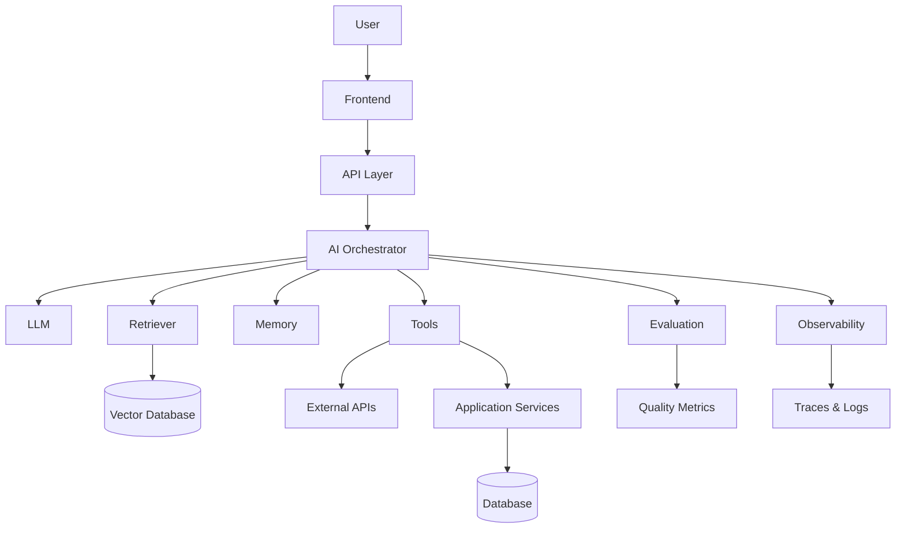

👋 Hi, I'm AI Forge

AI Full-Stack Engineer

AI Agents · LLM Applications · AI Automation · RAG · Full-Stack Engineering

I build production-oriented AI systems that combine LLMs, intelligent agents, automation, APIs, databases, and modern full-stack applications.

My focus is turning AI capabilities into reliable software that can reason, retrieve, use tools, execute workflows, and produce measurable results.

⚡ Engineering Focus

<table>
<tr>
<td width="50%">

🤖 AI Agents

Tool-using agents, agent orchestration, memory, planning, and autonomous workflows.

</td>
<td width="50%">

🧠 LLM Applications

Production applications built around modern language models and structured AI workflows.

</td>
</tr>

<tr>
<td>

🔎 RAG Systems

Document ingestion, chunking, embeddings, vector search, hybrid retrieval, and reranking.

</td>
<td>

⚙️ AI Automation

Intelligent workflows that connect AI models with APIs, databases, business systems, and external tools.

</td>
</tr>

<tr>
<td>

💻 Full-Stack AI

Modern frontend applications connected to AI-powered backend services.

</td>
<td>

☁️ Production AI

APIs, databases, containers, cloud infrastructure, observability, evaluation, and deployment.

</td>
</tr>
</table>

🧠 AI Stack

🛠️ Full-Stack Stack

Frontend

Backend

Data

Infrastructure

🚀 What I Build

<table>
  <tr>
    <td align="center" width="25%">
      <h3>🤖</h3>
      <strong>AI Agents</strong>
       
      Tool-using agents, state, memory & orchestration
    </td>
    <td align="center" width="25%">
      <h3>🔎</h3>
      <strong>RAG Systems</strong>
       
      Retrieval, embeddings, vector search & reranking
    </td>
    <td align="center" width="25%">
      <h3>⚙️</h3>
      <strong>AI Automation</strong>
       
      Intelligent workflows, APIs & automated execution
    </td>
    <td align="center" width="25%">
      <h3>🧠</h3>
      <strong>AI Copilots</strong>
       
      Context-aware assistants for real-world workflows
    </td>
  </tr>

  <tr>
    <td align="center">
      <h3>🔗</h3>
      <strong>Multi-Agent Systems</strong>
       
      Specialized agents with structured collaboration
    </td>
    <td align="center">
      <h3>📄</h3>
      <strong>Document Intelligence</strong>
       
      Extraction, processing, retrieval & analysis
    </td>
    <td align="center">
      <h3>🌐</h3>
      <strong>Intelligent APIs</strong>
       
      AI-powered backend services and integrations
    </td>
    <td align="center">
      <h3>💻</h3>
      <strong>AI SaaS</strong>
       
      Full-stack products built around AI workflows
    </td>
  </tr>
</table>

🤖 AI Agent Systems

Agents capable of selecting tools, maintaining context, executing actions, and completing multi-step tasks.

🔎 RAG Applications

Knowledge systems combining document processing, embeddings, retrieval, reranking, and LLM generation.

⚙️ AI Automation

AI-powered workflows that connect models with APIs, databases, applications, and external services.

🧩 Multi-Agent Systems

Specialized agents working together through structured orchestration and shared state.

💻 AI SaaS

Full-stack products where AI is integrated directly into the application's core workflow.

⭐ Featured AI Projects

🤖 AI Agent Platform

Production-oriented agent system capable of reasoning over user requests, selecting tools, executing actions, and returning structured results.

Architecture

User
  ↓
Next.js
  ↓
FastAPI
  ↓
Agent Orchestrator
  ↓
LLM
  ↓
Tools / APIs
  ↓
Database
  ↓
Structured Response

Stack

Python FastAPI LangGraph OpenAI PostgreSQL Docker

Capabilities

Tool calling

Agent state

Multi-step execution

Structured outputs

Error handling

Execution tracing

Repository · Live Demo

🔎 RAG Knowledge Assistant

Knowledge assistant that processes documents, creates embeddings, retrieves relevant context, and generates grounded responses.

Architecture

Documents
   ↓
Ingestion
   ↓
Extraction
   ↓
Chunking
   ↓
Embeddings
   ↓
Vector Database
   ↓
Retrieval
   ↓
Reranking
   ↓
LLM
   ↓
Answer

Stack

Python FastAPI PostgreSQL Vector DB Embeddings LLM

Capabilities

Document ingestion

Semantic search

Hybrid retrieval

Reranking

Source-aware answers

Retrieval evaluation

Repository · Live Demo

⚙️ AI Automation Engine

Intelligent automation platform that transforms user requests into executable workflows using AI-powered decision making.

Workflow

Trigger
   ↓
AI Classification
   ↓
Decision
   ↓
Tool Selection
   ↓
API Execution
   ↓
Validation
   ↓
Result

Stack

Python FastAPI LangGraph Redis PostgreSQL Docker

Capabilities

Workflow orchestration

Tool execution

API integrations

Conditional workflows

Retry handling

Execution monitoring

Repository · Live Demo

🧑‍💻 Multi-Agent Research System

Multi-agent research workflow where specialized agents collaborate to collect, analyze, verify, and synthesize information.

Architecture

Stack

Python LangGraph LLMs FastAPI React

Capabilities

Agent orchestration

Parallel execution

Shared state

Research synthesis

Verification

Structured reporting

Repository · Live Demo

🧠 AI SaaS Application

Full-stack SaaS application using LLMs to automate a complex user workflow from input to actionable output.

Architecture

React / Next.js
       ↓
API Layer
       ↓
Application Service
       ↓
AI Service
       ↓
LLM + Tools
       ↓
PostgreSQL
       ↓
Result

Stack

Next.js TypeScript Python FastAPI PostgreSQL OpenAI

Capabilities

Authentication

AI workflow

Persistent user data

Streaming responses

API integration

Production deployment

Repository · Live Demo

🛠️ AI Developer Assistant

AI-powered developer tool that analyzes code, retrieves project context, generates solutions, and assists with engineering workflows.

Stack

TypeScript Python LLM RAG FastAPI React

Capabilities

Code analysis

Repository context

RAG

Tool calling

Structured outputs

Developer workflow automation

Repository · Live Demo

🏗️ AI System Architecture

flowchart TD
    A[User] --> B[Frontend]
    B --> C[API Layer]
    C --> D[AI Orchestrator]

    D --> E[LLM]
    D --> F[Tools]
    D --> G[Memory]
    D --> H[Retriever]

    H --> I[Vector Database]
    F --> J[External APIs]
    F --> K[Application Services]

    K --> L[(Database)]

    D --> M[Evaluation]
    D --> N[Observability]

    M --> O[Quality Metrics]
    N --> P[Traces & Logs]

🔄 How I Build AI Systems

                    ┌─────────────┐
                    │   Problem   │
                    └──────┬──────┘
                           ↓
                    ┌─────────────┐
                    │     Data    │
                    └──────┬──────┘
                           ↓
                    ┌─────────────┐
                    │ Model / LLM │
                    └──────┬──────┘
                           ↓
                    ┌─────────────┐
                    │Context/Prompt│
                    └──────┬──────┘
                           ↓
                    ┌─────────────┐
                    │Tools / APIs │
                    └──────┬──────┘
                           ↓
                    ┌─────────────┐
                    │Agent/Workflow│
                    └──────┬──────┘
                           ↓
                    ┌─────────────┐
                    │ Evaluation  │
                    └──────┬──────┘
                           ↓
                    ┌─────────────┐
                    │Observability│
                    └──────┬──────┘
                           ↓
                    ┌─────────────┐
                    │ Production  │
                    └─────────────┘

📊 AI Engineering

I focus on making AI systems measurable and production-ready.

Area

Focus

Agent Quality

Task completion, tool selection, execution accuracy

RAG Quality

Retrieval relevance, grounding, answer quality

Latency

Model latency, retrieval latency, API latency

Reliability

Retries, fallbacks, validation, error handling

Cost

Token usage, model selection, caching

Observability

Traces, logs, execution monitoring

Evaluation

Automated and human evaluation

Automation

Workflow success and failure rates

I don't rely on fabricated project metrics. Production metrics are added only when they can be measured from the actual system.

🔨 Currently Building

AI Agent Infrastructure

Building reusable infrastructure for:

Agent State · Tool Calling · Memory · Workflow Orchestration · Observability

AI Automation Systems

Building intelligent workflows that combine:

LLMs → Decision Making → Tools → APIs → Databases → Execution

AI Full-Stack Applications

Building end-to-end applications using:

Next.js + TypeScript + Python + FastAPI + PostgreSQL + LLMs

🧪 Currently Exploring

Advanced LangGraph
        ↓
Agent Architecture
        ↓
Multi-Agent Systems
        ↓
LLM Evaluation
        ↓
Model Evaluation
        ↓
AI Observability
        ↓
Production AI Infrastructure
        ↓
LLM Optimization
        ↓
AI System Design

🧩 Engineering Principles

Build measurable AI systems.

Evaluate before optimizing.

Prefer deterministic workflows when autonomy is unnecessary.

Keep agents tool-driven and observable.

Separate retrieval, reasoning, execution, and evaluation.

Treat prompts and context as engineering components.

Design AI systems for production, not just demos.

Keep the application architecture independent from the model provider.

📈 GitHub Activity

🚀 Building With AI

LLMs
 │
 ├── RAG
 │    ├── Ingestion
 │    ├── Chunking
 │    ├── Embeddings
 │    ├── Retrieval
 │    └── Reranking
 │
 ├── Agents
 │    ├── Reasoning
 │    ├── Tools
 │    ├── Memory
 │    └── State
 │
 ├── Automation
 │    ├── Triggers
 │    ├── Decisions
 │    ├── Actions
 │    └── Validation
 │
 └── Production
      ├── Evaluation
      ├── Observability
      ├── Security
      └── Deployment

Building intelligent software, one system at a time.

